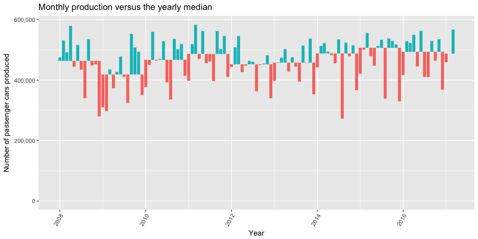
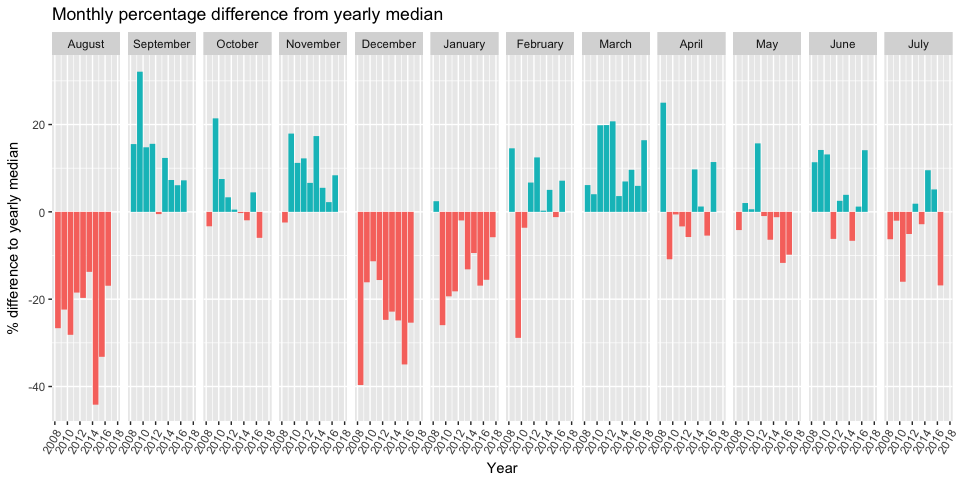

#German Car Production

#MakeoverMonday Week26

Published at:
http://rpubs.com/mrYeti1/germanCarProduction
http://rpubs.com/mrYeti1/germanCarProductionArrows
http://rpubs.com/mrYeti1/germanCarProductionV3

German Passenger Car production shows large variance between months of
the year.

September 2009 produced 32% more cars than the yearly average to produce
553,205.

While 272,744 cars in August 2014 was -44% the production of the average
in that year.

Breaking this out each month shows August, December, January are
predominently below the yearly average. March, September, November are
more productive.

